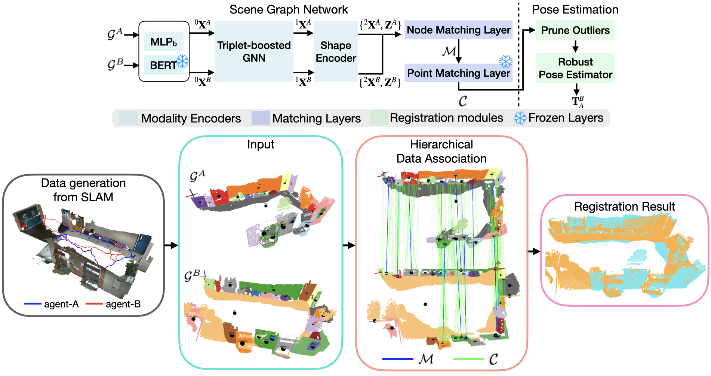

<!-- # SG-Reg -->

    <h1>SG-Reg: Generalizable and Efficient  Scene Graph Registration</h2>
    <strong>Submitted to IEEE T-RO</strong>
     
        <a href="https://uav.hkust.edu.hk/current-members/" target="_blank">Chuhao Liu</a>1,
        <a href="https://qiaozhijian.github.io/" target="_blank">Zhijian Qiao</a>1,
        <a href="https://jayceeshi.github.io/" target="_blank">Jieqi Shi</a>2,*,
        <a href="https://uav.hkust.edu.hk/group/alumni/" target="_blank">Ke Wang</a>3,
        <a href="" target="https://uav.hkust.edu.hk/current-members/"> Peize Liu </a>1
        and <a href="https://uav.hkust.edu.hk/group/" target="_blank">Shaojie Shen</a>1
    

        <h45>
            1HKUST Aerial Robotics Group &nbsp;&nbsp;
            2 NanJing University &nbsp;&nbsp;
            3Chang'an University &nbsp;&nbsp;
             
        </h5>
        *Corresponding Author
    

    
    <!--  -->
    

    

### News
<!-- * [?Dec 2024] Paper accepted by IEEE T-RO. -->
* [Oct 2024] Paper submitted to IEEE T-RO.

We will publish the code once the paper is accepted.