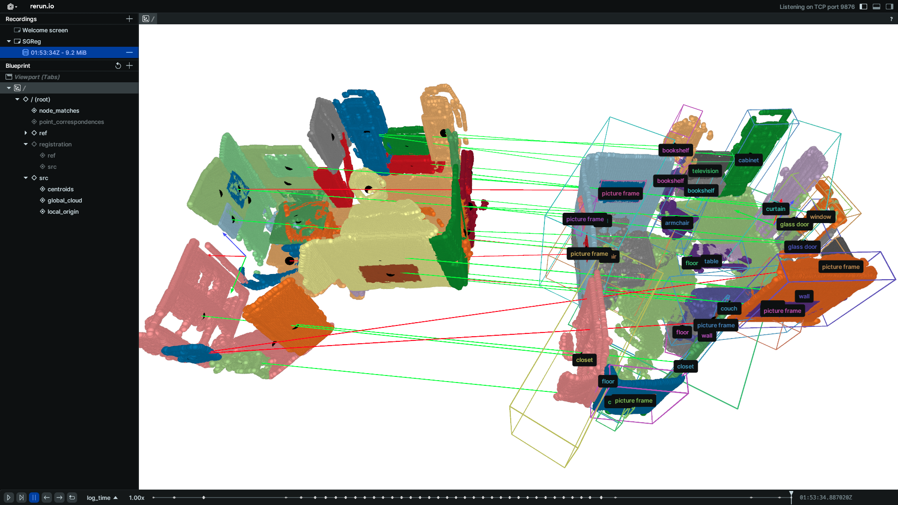

<!-- # SG-Reg -->
<div align="center">
    <h1>SG-Reg: Generalizable and Efficient</br> Scene Graph Registration</h2>
    <strong>Accepted by IEEE T-RO</strong>
    <br>
        <a href="https://glennliu.github.io" target="_blank">Chuhao Liu</a><sup>1</sup>,
        <a href="https://qiaozhijian.github.io/" target="_blank">Zhijian Qiao</a><sup>1</sup>,
        <a href="https://jayceeshi.github.io/" target="_blank">Jieqi Shi</a><sup>2,*</sup>,
        <a href="https://uav.hkust.edu.hk/group/alumni/" target="_blank">Ke Wang</a><sup>3</sup>,
        <a href="" target="https://uav.hkust.edu.hk/current-members/"> Peize Liu </a><sup>1</sup>
        and <a href="https://uav.hkust.edu.hk/group/" target="_blank">Shaojie Shen</a><sup>1</sup>
    <p>
        <h45>
            <sup>1</sup>HKUST Aerial Robotics Group &nbsp;&nbsp;
            <sup>2</sup> NanJing University &nbsp;&nbsp;
            <sup>3</sup>Chang'an University &nbsp;&nbsp;
            <br>
        </h5>
        <sup>*</sup>Corresponding Author
    </p>
    <a href="">  </a>
    <a href='https://arxiv.org/abs/2504.14440'></a>
    <a href="https://youtu.be/IDxAmvpB2T0"></a>
    <a href=""></a>

</div>

<p align="center">
    
</p>

### News
* [19 Apr 2025] Our paper is accepted by IEEE T-RO as a regular paper.
* [8 Oct 2024] Paper submitted to IEEE T-RO.

In this work, we **learn to register two semantic scene graphs**, an essential capability when an autonomous agent needs to register its map against a remote agent, or against a prior map. To acehive a generalizable registration in the real-world, we design a scene graph network to encode multiple modalities of semantic nodes: open-set semantic feature, local topology with spatial awareness, and shape feature. SG-Reg represents a dense indoor scene in **coarse node features** and **dense point features**. In multi-agent SLAM systems, this representation supports both coarse-to-fine localization and bandwidth-efficient communication. 
We generate semantic scene graph using [vision foundation models](https://github.com/IDEA-Research/Grounded-Segment-Anything) and semantic mapping module [FM-Fusion](https://github.com/HKUST-Aerial-Robotics/FM-Fusion). It eliminates the need for ground-truth semantic annotations, enabling **fully self-supervised network training**. 
We evaluate our method using real-world RGB-D sequences: [ScanNet](https://github.com/ScanNet/ScanNet), [3RScan](https://github.com/WaldJohannaU/3RScan) and self-collected data using [Realsense i-435](https://www.intelrealsense.com/lidar-camera-l515/).
## 1. Install 
Create virtual environment,
```bash
conda create sgreg python=3.9
```
Install PyTorch 2.1.2 and other dependencies.
```bash
conda install pytorch==2.1.2 torchvision==0.16.2 torchaudio==2.1.2 pytorch-cuda=11.8 -c pytorch -c nvidia 
```
```bash
pip install -r requirements.txt
python setup.py build develop
```

## 2. Download
Download our network weights from this [Dropbox link](https://www.dropbox.com/scl/fi/92f1fju4m6ikypopdxg2z/sgnet_scannet_0080.zip?rlkey=32ixcwx7onm9vjkzvwgfwqnq3&st=sokdtktv&dl=0) and uncompress the downloaded ```.zip``` file. Save the ```sgnet_scannet_0080``` at a directory you like, which is labelled as ```CHECKPOINT_FOLDER```.

Download the 3RScan data [坚果云nutStore link](https://www.jianguoyun.com/p/DVNIaZYQmcSyDRjX8PQFIAA). It involves $50$ pairs of scene graphs. The data are organized in the following structures.
<!-- todo -->
```
|--val
    |--scenexxxx_00a % each individual scene graph
    |-- ....
|--splits
    |-- val.txt
|--gt
    |-- SRCSCENE-REFSCENE.txt % T_ref_src
|--matches
    |-- SRCSCENE-REFSCENE.pth % ground-truth node matches
|--output
    |--CHECKPOINT_NAME
        |--SRCSCENE-REFSCENE % results of scene pair
```


We also provide another 50 pairs of ScanNet scenes. Please download the ScanNet data using this [坚果云nutStore link](https://www.jianguoyun.com/p/DSJqTN8QmcSyDRjZ8PQFIAA). They are organized in the same data structure as the 3RScan data.


## 3. Inference 3RScan Scenes
To run the inference program, 
```bash
python sgreg/val.py --cfg_file config/rio.yaml --checkpoint $CHECKPOINT_FOLDER$
```
It will inference all of the downloaded scene pairs in 3RScan. The registration results, including matched nodes, point correspondences and predicted transformation are saved at ```RIO_DATAROOT/ouptut/CHECKPOINT_NAME/SRCSCENE-REFSCENE```. You can visualize the registration results,
```bash
python sgreg/visualize.py --dataroot $RIO_DATAROOT$ --viz_mode 1 --find_gt --viz_translation [3.0,5.0,0.0]
``` 
It should visualize the results as below,
<p align="center">
    
</p>
On the left column, you can select the entities you want to visualize. 

If you run the program on a remote server, rerun supports remote visualization (see [rerun connect_tcp](https://ref.rerun.io/docs/python/0.22.1/common/initialization_functions/#rerun)). Check the arguments instruction in [visualize.py](sgreg/visualize.py) to customize your visualization.

*[Optional]* If you want to evaluate SG-Reg on ScanNet sequences, adjust the running options as below,
```bash
python sgreg/val.py --cfg_file config/scannet.yaml --checkpoint $CHECKPOINT_FOLDER$ 
python sgreg/visualize.py --dataroot $SCANNET_DATAROOT$ --viz_mode 1 --augment_transform --viz_translation [3.0,5.0,0.0]
```

## 4. Evaluate on your own data
If you are interested in the semantic scene graph tasks we are doing, we encourage you to collect your own RGB-D sequence to evaluate. 
It requires [VINS-Mono](https://github.com/HKUST-Aerial-Robotics/VINS-Mono) to compute camera poses, [Grounded-SAM](https://github.com/IDEA-Research/Grounded-Segment-Anything) to generate semantic labels, and [FM-Fusion](https://github.com/HKUST-Aerial-Robotics/FM-Fusion) to reconstruct a semantic scene graph.
We will add a detailed instruction later to illustrate how to build your own data.

## 5. Develop Log
- [x] Scene graph network code and verify its inference.
- [x] Remove unncessary dependencies.
- [x] Clean the data structure.
- [x] Visualize the results.
- [x] Provide RIO scene graph data for download.
- [x] Provide network weight for download.
- [ ] Registration back-end in python interface.
- [ ] Validation the entire system in a new computer. 
- [x] A tutorial for running the validation.

We will continue to maintain this repo. If you encounter any problem in using it, feel free to publish an issue.

## 6. Acknowledge
We used some of the code from [GeoTransformer](https://github.com/qinzheng93/GeoTransformer), [SG-PGM](https://github.com/dfki-av/sg-pgm) and [LightGlue](https://github.com/cvg/LightGlue). [SkyLand](https://www.futureis3d.com) provides lidar-camera suite to allow us evaluating SG-Reg in large-scale scenes (as demonstrated in our [video]()).

## 7. License
The source code is released under [GPLv3](https://www.gnu.org/licenses/) license.
For technical issues, please contact Chuhao LIU (cliuci@connect.ust.hk). 
